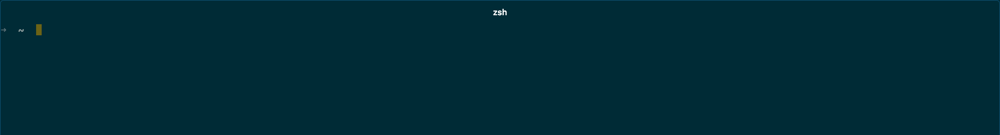
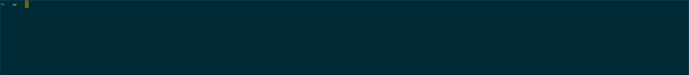

## what it does
trying to get a true fullscreen similar to my previous setup in iterm.  
with no header so that if we use vim we have as much real estate as possible for our code
## normal layout

## modification
With our plugin

## How to use

To install add `hyper-true-fullscreen`
to `plugins` in `~/.hyper.js`.

To make things even better use [hyperfull](https://github.com/simonmeusel/hyperfull)

